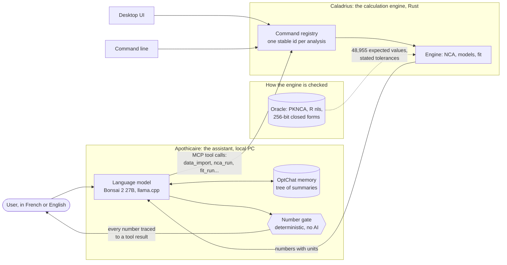
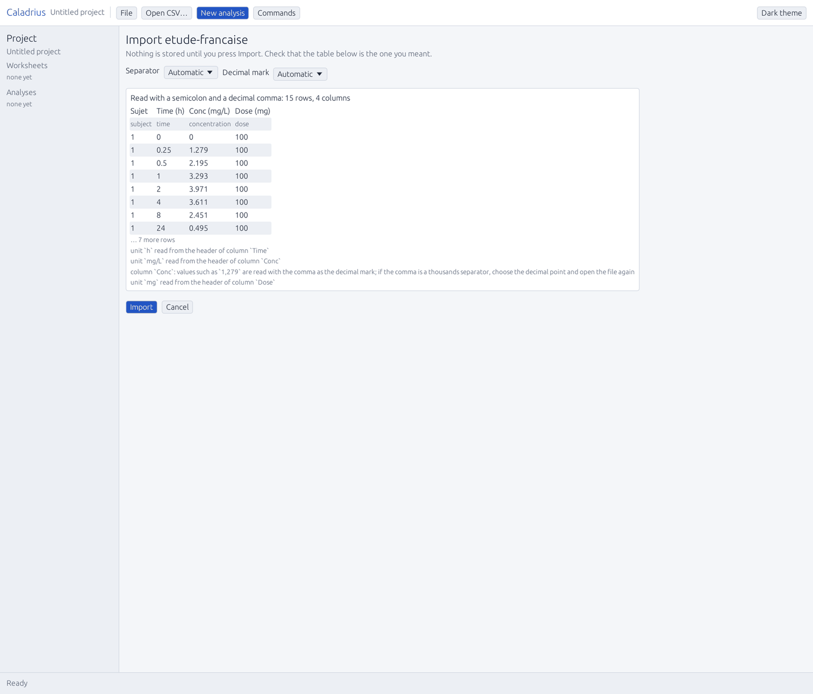
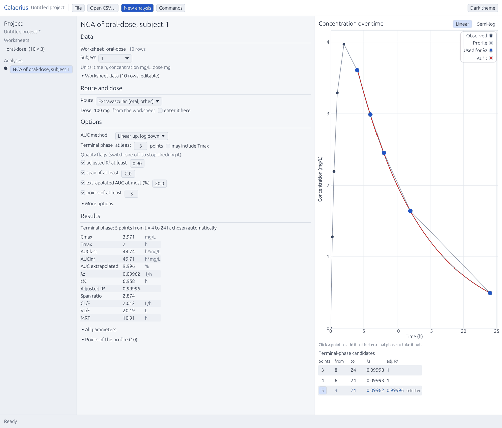
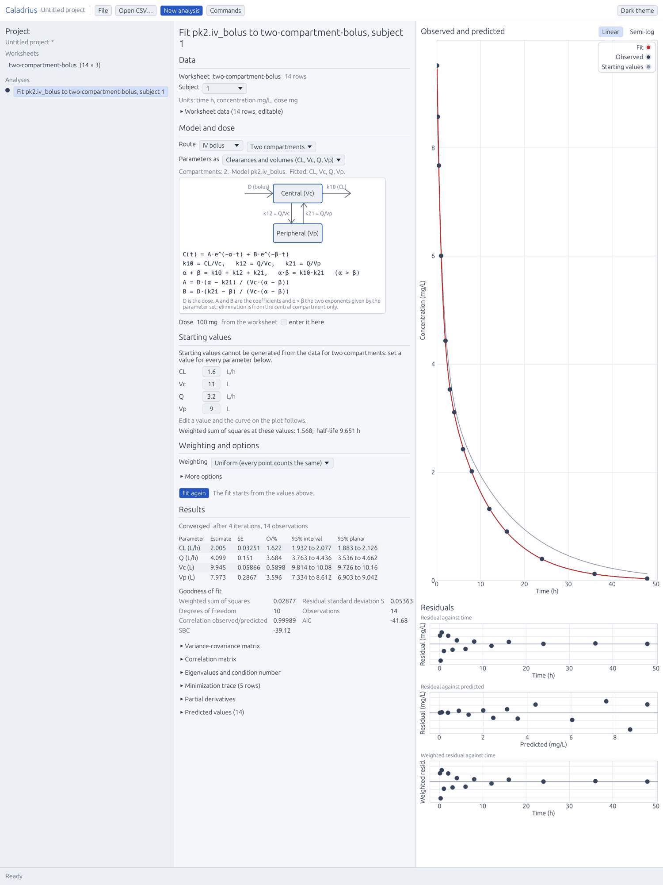

# Caladrius

Open-source pharmacokinetic analysis in Rust: non-compartmental analysis, individual compartmental models, weighted least-squares fitting and plots, with a native desktop UI (egui) and a WebAssembly demo. Every analysis is a command with a stable id, so the same calculations are available from the UI, the command line and an MCP server for agents. Caladrius is the calculation layer of Apothicaire, a local DMPK assistant.

## In plain words

**What this is.** Caladrius is a small program that does the standard calculations of pharmacokinetics: how fast a drug is absorbed, how far it spreads in the body, how fast it leaves. Pharmacists and pharmaceutical scientists do these calculations every day with commercial software. Caladrius does a subset of them, in the open, with every number checked against an independent calculation.

**What this is not.** It is a prototype and a learning project. It is not a replacement for the commercial software used in industry, and it does not claim to be: the section "What is verified, and what is not" says exactly which calculations are checked, against what, and which are not. Population modelling, bioequivalence and regulatory submissions are out of scope.

**Who is building it, and why.** I am Abdallah Ragued. I hold a Master's degree in health data science (Université Paris-Saclay) and I am now in the Master's programme in pharmacokinetic modelling at Université Paris Cité (PBPK and PK/PD modelling, population pharmacokinetics). I spent six months as a pharmacometrics intern at Sanofi R&D in Montpellier, evaluating and optimising population PK trial designs with Fisher information methods in NONMEM, and building an R/Shiny application to compare design outputs; that work received one of three awards at the Congrès Junior Pluridisciplinaire of Paris-Saclay and ENS in May 2026. I want to do a PhD at the meeting point of drug metabolism and pharmacokinetics (DMPK) and artificial intelligence. In my coursework the standard calculations are done in a commercial program that shows results but not its reasoning. Rebuilding them from textbooks, with a test for every rule, is how I make sure I understand them. The second reason is the question below: can a local AI be trusted with these numbers? To answer it honestly I needed a calculation engine whose every output I could verify. This repository is that engine, and the portfolio I show when I apply for internships and positions.

**How it fits with Apothicaire.** Apothicaire is the other half of the project: a DMPK assistant that runs entirely on one consumer PC (a single 12 GB graphics card, nothing sent to the cloud). It is not a chatbot. The language model (today Bonsai 2 27B, a "ternary" model from PrismML that fits the card; other small open models are candidates to compare, such as Underdog Saluki 27B and Woof 4B from Conway Research) is allowed to read the user's data, decide which calculation to run, call Caladrius, and explain the result. It is never allowed to compute a pharmacokinetic number itself. A deterministic check, written in plain Python and not learned, reads every answer and rejects any number that does not come from a tool result or from the user. On a benchmark of 25 simulated exercises and 200 questions, that check found 76 invented numbers in the model's first drafts (all in the one question that tempts it to do arithmetic) and 0 after the engine was given a `compare` command. The point of the design is that the AI is the one part that can be wrong, so it is surrounded by parts that cannot.



**Why Rust.** Not for speed; these calculations are small. Rust was chosen because the compiler enforces the rules this project cares about. A value that may be missing must be handled where it appears. There is no garbage collector and no runtime to install, so the engine is one file that runs on Windows, Linux and a Mac, and the same code compiles to WebAssembly for a browser demo. The project forbids every way of crashing on bad input (the `unwrap`, `panic` and indexing patterns are denied by the linter in every crate), so a malformed CSV or a non-estimable half-life gives a readable error, not a crash. Lastly, the layer rules (the numerical crates may not depend on the interface, the interface holds no numerical code) are checked by a command in the continuous integration, so the engine stays usable from a test, a terminal, an agent or a window alike.

**Why OptChat.** A conversation about a dataset can be long, and a 12 GB card cannot keep all of it in the model's context. OptChat is an idea by Victor Taelin: keep the whole chat on disk, and show the model a view where recent messages are verbatim and older ones are progressively merged into summary lines, arranged as a binary tree. Nothing is ever deleted, the view always covers the whole history, and the cost stays bounded. The prototype in `../optchat/` recalled 8 of 8 planted facts after 32 turns of filler on the local model, which is why Apothicaire imports it unchanged.

**How it is built, and what went wrong.** The code is written by AI coding agents (Claude Code, with a DeepSeek agent as a second contributor) working under a written contract, `AGENTS.md`, with a task board in `board/` and a human who answers questions and decides what is published. The rules that matter most: no code is ever copied from the commercial software (clean room, textbooks and public documentation only); no change without a test; the conformance counts can only go up. The honest part is in the validation section below: one of the reference scripts was wrong once and the engine was right, and the repository records how that was found and fixed rather than hiding it in a tolerance.

**A guided tour.** `docs/explainer.html` is a self-contained page (no network, no library) that walks through the same story with a diagram, a toy concentration curve you can move, one question followed through the number gate, and a glossary. Download it and open it in a browser.

**Sources, tools and credits.** Everything the project stands on, with its license, is listed in `ATTRIBUTION.md` and `specs/sources.md`; the short version:

- Pharmacokinetics: Gabrielsson and Weiner, *Pharmacokinetic and Pharmacodynamic Data Analysis*; Gibaldi and Perrier, *Pharmacokinetics*; Rowland and Tozer, *Clinical Pharmacokinetics and Pharmacodynamics*; Bertrand and Mentré (2008) for the compartmental closed forms.
- Independent calculations the engine is checked against: `PKNCA` (Bill Denney and contributors), R and its packages `Rmpfr`, `expm`, `deSolve`, `minpack.lm`; the public `Theoph` and `Indometh` datasets shipped with R.
- Rust ecosystem: `egui`, `eframe` and `egui_plot` (Emil Ernerfeldt and contributors) for the interface, `wgpu` and `winit` for rendering and windows, `serde` for every command's parameters, and the rest of `Cargo.lock`.
- Model Context Protocol (MCP), the open protocol through which Apothicaire calls Caladrius.
- Apothicaire's model and runtime: Bonsai 2 27B and the PrismML fork of `llama.cpp` (Georgi Gerganov and the ggml contributors); Underdog Saluki 27B and Woof 4B (Conway Research) as candidates for comparison; the OptChat gist by Victor Taelin; the Liquid AI `d1` decision models considered for a small judge on the roadmap.
- The agents that wrote the code: Claude Code (Anthropic) and the DeepSeek Harness `dsh` (DeepSeek).
- The commercial reference software named in the trademark notice below is used in my coursework only; its results were compared once, privately, on counts, and nothing from it is in this repository.

## Status

Status (2026-10-09): NCA, one- and two-compartment models and weighted least-squares fitting are checked against PKNCA, exact closed forms and R `nls`/`nlsLM` at stated tolerances (what is covered, and what is not, is in the section "What is verified, and what is not"); the conformance table holds 48955 of 48955 values (`docs/conformance.md`). A CLI and an MCP server expose every command, and the desktop UI (step 5) covers the NCA, fit and simulation pages, project files, the command palette and settings. `v0.2.0` is tagged with Linux and Windows binaries; the multiple-dosing work landed after it and is on `main`, not in the tag. See `AGENTS.md` for the contract and `board/INDEX.md` for the task board.

Named after the caladrius, the white bird of Roman legend said to take a sick person's illness away as it flies off.

## Trademark notice

Caladrius is an independent project and is not affiliated with, endorsed by or derived from Certara. Phoenix and WinNonlin are trademarks of Certara. Caladrius aims at compatible conventions for standard pharmacokinetic calculations, reimplemented from public textbooks and documentation.

## License

MIT OR Apache-2.0. Third-party data and assets are listed in `ATTRIBUTION.md`.

## Build

Requires Rust stable 1.85 or newer, installed with rustup (`rust-toolchain.toml` selects the stable channel). The WebAssembly check also needs the `wasm32-unknown-unknown` target: `rustup target add wasm32-unknown-unknown`. Prebuilt binaries for Linux and Windows are attached to each release: <https://github.com/officina-dmpk/caladrius/releases>.

```sh
cargo build --workspace
cargo test --workspace
cargo clippy --workspace --all-targets -- -D warnings
cargo xtask layers   # prints the layer table, fails if a crate depends on a higher layer
cargo xtask lint     # contract checks: forbidden names, private/ leaks, deny-lints headers, tolerances once, board hygiene (exceptions in xtask/lint_allow.toml)
cargo xtask review   # the figures this README and the specs state, confronted with the files that own them (read-only; --strict also fails on a note)
cargo xtask wasm     # checks that layers L0 to L3 compile for wasm32-unknown-unknown
```

`cargo xtask` is an alias for the `xtask` crate (see `.cargo/config.toml`). The layers and their rules are in `AGENTS.md`, section 4.

## What is verified, and what is not

"Validated" here has a narrow meaning: a number produced by Caladrius equals a number produced by an independent computation, within a stated tolerance, on a stated case. It does not mean that Caladrius gives the same answer as any commercial program, and the table says where the independent computation comes from. Everything is reproducible: the R scripts that write the expected values are in `oracle/scripts/` (versions recorded in each `*.options.json`), `cargo xtask conformance` regenerates `docs/conformance.md` (the per-case counts; never edited by hand), and the tests are in `crates/*/tests/`. The full validation report — versions, methods, tolerances, coverage, documented differences, open items and how to reproduce — is `docs/validation.md`.

| What | Checked against | Tolerance (relative) | Cases and values | Not validated |
|---|---|---|---|---|
| NCA parameters: extravascular, IV bolus, IV infusion; linear and lin-up/log-down areas | `PKNCA` 0.12.1 on R 4.5.2 (`oracle/scripts/nca_pknca.R`): Theoph and Indometh (the R datasets, two area rules each), 14 edge-case runs on hand-made profiles (values below the limit, missing, negative, lag, infusion, IV C0) and 2 runs on 4 hand-made profiles built to separate the readings of the terminal-phase rule; plus naive second implementations in `caladrius-testkit` | 1e-6 | 20 cases, 3744 values; 16 more values are a documented difference (D-01), counted in neither column | Steady state and multiple doses, partial AUC, urine, sparse sampling, weighted lambda-z (`specs/nca.md` section 12, "not specified"); the combinations of open item O-17; every reference-software convention (last row) |
| Model curves, AUC and secondary parameters: six one-compartment models (IV bolus, IV infusion, first-order oral with and without lag, zero-order oral with and without lag) | Exact closed forms evaluated in 256-bit arithmetic (`Rmpfr` 1.1.3), cross-checked against a matrix exponential (`expm` 1.0.1) and an ODE solver (`deSolve` 1.42); textbook double-precision forms in `caladrius-testkit` | 1e-12 | 145 cases, 9405 values: 21 single-dose cases (886 values) and, since tasks T-047 and T-049, 124 multiple-dose and steady-state cases (schedules of 1 to 40 doses, regular regimens, steady state for several intervals) with their refusals | Any other program's output; user-written models (not implemented). The closed forms are the project's own derivation from textbooks, checked three ways, not an external reference |
| Model curves, AUC, AUMC, partial derivatives and refused inputs: six two-compartment models (IV bolus, IV infusion, first-order oral with and without lag, zero-order oral with and without lag), in the macro, micro and clearance/volume parameter sets (added by tasks T-031 to T-034) | Explicit sums of exponentials evaluated in 256-bit arithmetic (`Rmpfr`) and central differences of them, cross-checked on every case against a matrix exponential (`expm`) and an ODE solver (`deSolve` lsoda); `oracle/scripts/models_2c_closed_form.R`, `models_2c_derivatives.R` | 1e-12 | 295 cases, 25306 values: 107 single-dose value cases, 64 derivative cases (conditions above 1e3 omitted), `model_pk2_errors` (80 not-available rows the engine must refuse, with the reason) and, since tasks T-047 and T-049, 124 multiple-dose and steady-state cases with their refusals | Any other program's output; user-written models (not implemented); the two-compartment fit (only one-compartment fits have a reference fit, see the rows below). As for one compartment, the closed forms are the project's own derivation from textbooks, checked four ways rather than against an outside reference |
| Fit, IV bolus and first-order oral: estimates and every statistic (standard errors, CV%, intervals, correlation, eigenvalues, AIC, SBC, secondary parameters) | `stats::nls` (Gauss-Newton) and `minpack.lm` 1.2.4 `nlsLM` on R 4.5.2 (`oracle/scripts/fit_wls.R`); statistics from an independent R implementation of `specs/fit.md`, standard errors and S checked against `summary.nls` | 1e-4 parameters and statistics, 1e-6 residual sum of squares | 15 cases (Theoph, 12 subjects; Indometh, 6; a five-point example), five weightings each: 95 fits, 5340 values (with the convergence status) | Default settings (closed-form derivatives, relative decrease 1e-10, 50 iterations): 0 of 490 estimates beyond 1e-4 on the 185 reference fits (worst 7.4e-6); the former defaults, kept as the preset `reference_conventions`, give 168 (worst 5.8e-3) (`specs/differences.md` D-03, D-04; Q-014 answered). Bounds, generated initial estimates and quality flags have unit tests only |
| Fit, IV infusion, zero-order input, first-order with lag (added by task T-029) | `nlsLM` checked against `nls`, same R and package versions, on synthetic profiles written by the same script from the closed forms (fixed seed, 8 % log-normal noise; each options file says how); the infusion or input duration is a fixed parameter | 1e-4 and 1e-6 as above | 15 cases, 90 fits, 5070 values (5160 with status). 1e-4 on parameters and statistics. The engine's own closed-form derivatives for these models (task T-030) reproduce all of them: 125 of 125 oracle tests pass (`crates/caladrius-fit/tests/oracle_fit_models.rs`) and the conformance run validates all 5160 values | Real (non-synthetic) profiles for these models; a published worked example with a page reference for any fit |
| The reference commercial software | One private coursework exercise, kept out of the repository. Only counts are recorded and nothing from it, numeric or otherwise, is published here (publishing a comparison is the maintainer's decision) | equality at the displayed precision | counts only, in a local run | Everything else. Its fitting defaults (increment, convergence, bounds) and its definitions of the fit statistics are `assumed` from the maintainer's observation and have not been tested against its output |

**One oracle was wrong once, and was corrected.** For the predicted-value weightings (`inv_yhat`, `inv_yhat2`) on Indometh, the engine and the first version of the R oracle disagreed on nine subject fits. The disagreement was recorded (`specs/differences.md`, D-02) instead of being absorbed into a tolerance, and was settled in task T-018: the engine's points were checked independently and upheld, while the oracle script had accepted degenerate "fixed points" (predictions of 1e-90) and missed real ones; the script was corrected and its cases regenerated. So the oracle is not infallible. It is now also checked by a naive Rust re-computation of every statistic and of the optimality condition `J' W r = 0` (`crates/caladrius-testkit/tests/step3_consistency.rs`), which is what would have caught the error.

**Why 1e-4 for fit parameters and 1e-6 for NCA.** NCA is closed arithmetic on the data, so two correct implementations differ only by rounding. A fit is a search: two optimizers stop at different points because of their stopping rules, and the engine's default derivatives are finite differences while the references use exact ones. The contract tolerance (1e-4) is a margin of caution, and the measured gaps are much smaller: over the 95 older reference fits the worst difference is 7.4e-6 on an estimate, 9.2e-6 on a standard error and 3.8e-7 on the residual sum of squares (the tolerance is about 14 times the worst on estimates, 11 times on standard errors, and only 2.6 times on the residual sum of squares), and on the five-point example, which is small enough to be worked on paper, the engine and R agree to 1e-6 on every statistic, and a test holds them to it (only the estimates are also tied to a second scripted recurrence; the other statistics are the engine against R). No tolerance has been loosened; the reasoning and the command that reproduces the figures are in `specs/fit.md` section 10.

**Where the numbers come from.** None of the values in the conformance table comes from the reference commercial software: every expected value is produced by PKNCA, by 256-bit evaluations of closed forms cross-checked with expm and deSolve, or by R nls and nlsLM, from public or synthetic data, with a versioned script. The reference software was compared once, privately, on counts only.

**Which rules are settled.** Every behaviour rule in `specs/` carries a status. "Confirmed by oracle" means the rule's arithmetic or definition agrees with PKNCA, R or the closed forms above; it says nothing about the reference commercial software. Counts of the `- Status:` lines in each file (made with `grep`):

| Specification | confirmed by oracle | documented, untested | assumed | observed |
|---|---|---|---|---|
| `specs/nca.md` | 44 | 15 | 12 | 5 |
| `specs/models.md` | 52 | 2 | 11 | 0 |
| `specs/fit.md` | 18 | 3 | 21 | 0 |
| `specs/ux.md` | 0 | 12 | 26 | 0 |

The `assumed` rules are the ones that a reference comparison or a human decision still has to settle (for example the fit defaults of `AGENTS.md` section 6); none is presented as settled.

## The application

<table>
<tr>
<td width="33%"><br><sub><b>Import.</b> A French export (semicolons, decimal commas) read before anything is stored: roles, units and the reading of each value are shown, and the other possible reading is named.</sub></td>
<td width="33%"><br><sub><b>NCA.</b> Parameters, quality flags and the terminal-phase candidates on one page; the range is chosen automatically and every point can be added to or taken out of the regression.</sub></td>
<td width="33%"><br><sub><b>Fit.</b> Two compartments, three parameter sets, the fitted curve and the residuals; estimates with standard error, CV% and both intervals, one sentence per flag.</sub></td>
</tr>
</table>

[More screenshots of the application](docs/screens/) — import, NCA, fitting, simulation and the command
palette. Every scene is drawn offscreen by `crates/caladrius-ui/examples/snapshot.rs`
(`cargo run -p caladrius-ui --example snapshot`), through the application's own actions and engine
commands; the interface holds no numerical code and reads no file itself. In "More options" of the fit page, a `Preset` choice (the default settings or `reference_conventions`) fills the iteration settings with the values the engine holds; the fields stay editable and an edit reads "Custom".

## Conformance

`cargo xtask conformance` runs `caladrius-nca` on every case of `oracle/expected/`, `caladrius-models` on every case of `oracle/expected/models/` (relative error 1e-12) and `caladrius-fit` on every case of `oracle/expected/fit/` (1e-4 on estimates and statistics, 1e-6 on the residual sum of squares), and regenerates `docs/conformance.md` (never edit it by hand). A value counts as validated only if the engine computes the parameter and it is within the tolerance of the expected value. The file ends with one floor line per parameter per case (validated and expected rows). The task fails and leaves the file unchanged if a parameter validates fewer values, loses expected rows, gains unvalidated rows or disappears, if a floor line is malformed, or if a non-empty previous file holds no floor. Floors can only go up. The file is written to a temporary file then renamed.

## Usage

The command-line application runs the same commands as the UI and the MCP server (`caladrius-cli commands` lists them with their titles; `caladrius-cli commands --format json` adds the JSON schema of the parameters and results of each).

```sh
# NCA of the Theoph dataset, one table (subject, parameter, value, reason) on standard output
cargo run -q -p caladrius-cli -- nca.run --csv oracle/data/theoph.csv --param route=extravascular --format csv

# the same as JSON, linear trapezoids, one subject
cargo run -q -p caladrius-cli -- nca.run --csv oracle/data/theoph.csv --param route=extravascular --param options.auc_method=linear --param subject=1

# a model fit; the project file keeps the work between calls
cargo run -q -p caladrius-cli -- fit.run --csv oracle/data/indometh.csv --project indo.caladrius.json --param subject=1 --param model=pk1.iv_bolus --param weighting=inv_y2 --format csv
cargo run -q -p caladrius-cli -- project.describe --project indo.caladrius.json
```

`--param KEY=VALUE` sets one parameter (JSON when the value parses, text otherwise; `a.b=1` nests; `csv=@file` reads a file), `--json FILE` (or `-` for standard input) gives them all as an object, `--csv FILE` imports a worksheet first and is used by commands that take a `worksheet`, `--project FILE` loads and saves the project (worksheets, analyses with their options and results, and the history of the commands), `--format csv` prints the main table of an analysis (`--table NAME` picks another). What an import guessed (roles, units) and unit warnings go to standard error. A failure prints `error: <code>: <message>` and exits with code 1.

`caladrius-cli compare A B --project FILE` (MCP tool `analysis_compare`) compares two analyses of one subject, NCA or fit: for each parameter they share, both values with units, the difference, the relative difference in percent and the ratio, computed by the engine (never convert or subtract by hand), or `not_comparable` with the reason (unit mismatch, missing value, a = 0); `--format csv` prints the table.

A saved project contains the data it was built from, twice: in its worksheets, and in the history, which keeps the parameters of each command up to 64 KiB (an import keeps its CSV text; from the second invocation on, a `project.load` entry can hold the previous project text while that is under 64 KiB). This is provenance, and it makes the file larger and de-identification harder: before sharing a project, remove the `history` array from the JSON file (the project loads without it; `history_restored` is then false), or start from `project.new` and import only what you want to keep.

## MCP

`caladrius-mcp` is a Model Context Protocol server on standard input and output (JSON-RPC 2.0, one message per line; no network). It exposes every command of the registry as a tool: `data_import`, `nca_run`, `fit_run`, `model_simulate`, `export_table`... (the command id with `.` written `_`; the original id is accepted too). Each tool's `inputSchema` and `outputSchema` are the JSON schemas of the command, a result is JSON text content plus `structuredContent`, and a failing command is a tool error (`isError: true`) whose text is `<code>: <message>`. The server keeps one project for the session: worksheets and analyses persist between calls, `project_save` returns the whole project and `project_load` restores it.

Limits: the server handles one request at a time, so a long fit blocks the loop until it ends (no progress notifications, and a `ping` sent meanwhile is answered afterwards); a line longer than 64 MiB is answered with an error and skipped, a batch is limited to 100 requests, a message without an `id` is a notification and is never answered, and a byte order mark on the first line is ignored.

Build the binary once, then register it in the agent host.

```sh
cargo build --release -p caladrius-mcp      # target/release/caladrius-mcp
```

Claude Code, in `.mcp.json` at the root of a project (or `claude mcp add caladrius -- /path/to/caladrius-mcp`):

```json
{
  "mcpServers": {
    "caladrius": {
      "command": "/path/to/caladrius/target/release/caladrius-mcp",
      "args": []
    }
  }
}
```

Any other host that starts MCP servers over stdio (Pi Durable, dsh, an Apothicaire agent): run `/path/to/caladrius-mcp` with no arguments as a child process and speak the protocol on its standard input and output; a quick check by hand:

```sh
printf '%s\n' '{"jsonrpc":"2.0","id":1,"method":"initialize","params":{"protocolVersion":"2025-06-18","capabilities":{},"clientInfo":{"name":"hand","version":"0"}}}' '{"jsonrpc":"2.0","method":"notifications/initialized"}' '{"jsonrpc":"2.0","id":2,"method":"tools/list"}' | caladrius-mcp
```

## Desktop

`caladrius` is the desktop application (egui on wgpu): a project tree, the worksheet, and three analysis pages, each read from top to bottom with its plot always visible beside it: NCA (data, route and dose, options, results), model fit (data, model and dose, starting values, weighting and options, results) and model simulation. Every action goes through the same engine commands as the CLI and the MCP server; the interface holds no numerical code and reads no file itself.

```sh
cargo run -p caladrius                       # open the window
cargo run -p caladrius -- oracle/data/theoph.csv   # open it with a file to import
cargo run -p caladrius -- study.caladrius.json     # open a saved project
cargo run -p caladrius -- --help             # usage, without a window
```

- Open a CSV with the button or drop it on the window. A preview shows the table as it will be read (separator and decimal mark detected, with the other readings listed and the checks on each: a decimal comma read as a separator, a time that goes back or repeats) before anything is imported; you can change the separator and the decimal mark there.
- The worksheet is editable: click a cell, type a number with a point or a comma, press Enter. Columns take a role (time, concentration, subject, dose) and a unit.
- `New analysis` opens the NCA page and runs it at once; any change of route, dose or option runs it again. The plot has a linear and a semi-log view (a zero or negative concentration is left out of the log view only, and a note says how many); click a point to add it to the terminal phase or take it out, or click a candidate row; `Back to automatic` undoes the choice. The summary comes first, with a marker and a sentence for each quality flag, then all parameters, the candidate fits and the profile on demand.
- `New analysis` is one menu: NCA, model fit, model simulation. `Model fit` is picked by route (IV bolus, IV infusion, oral first-order or zero-order, with or without a lag time) and by one or two compartments, and shows the compartment diagram and the equation of the model it picked; for two compartments it also offers the parameter set (clearances and volumes, micro-constants, or macro-constants) and the palette has `New two-compartment fit` and `New two-compartment simulation`. The starting values are generated from the data (`fit.initial_estimates`) and can be edited (for two compartments the engine cannot generate them: the page says so in one sentence and asks for every value, shows placeholders muted until you set them, and the `Fit` button waits): the curve on the plot (`model.simulate`) and the weighted sum of squares (`fit.evaluate`) follow every change. Weighting and the options of the fit (iterations, convergence, derivatives, confidence level, flag thresholds) are on the same page. `Fit the model` runs `fit.run`; the summary comes first: convergence, estimates with standard error, CV% and both confidence intervals (univariate and planar), goodness of fit, and a sentence for each flag (high CV%, an interval that contains zero, strongly correlated estimates, non-convergence) saying what to check. The plot shows the data and the fitted curve (linear or semi-log), with the residual plots (against time, against predicted, weighted) under it. The variance-covariance and correlation matrices, eigenvalues and condition numbers, the minimization trace, the partial derivatives and the predicted values are one click away. Every curve is computed by the engine, never by the interface.
- `Model simulation` needs no data: pick a model, give a dose, the parameters and a time range, and the engine's curve and secondary parameters (half-life, clearance, AUC to infinity, predicted peak) update as you type. Opened with a worksheet selected, it takes that worksheet's units (otherwise it says there is no worksheet and the values carry no unit); `Save as analysis` stores it in the project and saving again updates that analysis instead of adding another. Durations are fields with their unit written in them.
- After an edit of the data, the analysis is marked out of date in the tree (amber name, a sentence on hover, a `Run again` button, a count under the project name), on the page and on the plot until it is run again. Analyses are named from their content (`NCA of oral, subject 1`), not by a running number.
- **Projects.** The `File` menu has New project, Open project, Open CSV, Save (Ctrl+S), Save as (Ctrl+Shift+S) and Quit; they go through the commands `project.new`, `project.load` and `project.save`. The window title is the project name with a `*` while there are unsaved changes (the project differs from the file last saved or opened). Starting a new project, opening another, dropping a project file on the window or closing the window with unsaved changes asks first: save, don't save, or cancel. A file that cannot be read says why and changes nothing. Files are written whole (a neighbouring temporary file replaces the target), so a failed save does not damage the previous one.
- **Command palette.** Ctrl+K (or the `Commands` button) opens a searchable list: the actions of the interface (new NCA or model fit from the selected worksheet, new simulation, theme, settings), every analysis and worksheet by name, and every command of the engine registry with its id, title and one-line description. Enter runs the highlighted entry with the current selection as context, or opens the page that asks for its parameters. From a worksheet, Ctrl+K, `nca`, Enter creates an NCA.
- **Settings.** `Commands`, then `settings` (or the palette entry `Open settings`) opens one searchable page: interface language (a placeholder, English only), theme (light, dark, or follow the system), decimal mark (point or comma) and significant digits, and the defaults a new NCA (AUC method, terminal-phase options) and a new fit (weighting, iterations, convergence) start from. Each row says what it affects and shows its default, with a way back to it. They are stored in `settings.json` in the application's configuration folder (`%APPDATA%\Caladrius` on Windows, `~/Library/Application Support/Caladrius` on a Mac, `$XDG_CONFIG_HOME/caladrius` or `~/.config/caladrius` elsewhere). The operating-system locale is read at start, shown on the page, and used only as the first suggestion for the decimal mark on a first start (the page says so); changing the decimal mark never changes stored data or what a CSV import understands.
- Colours, radii, spacing and font sizes are the tokens of `crates/caladrius-ui/src/theme.json` (light and dark). `cargo run -p caladrius-ui --example snapshot` renders each screen to `target/snapshots/*.png` without a window.

## Citing

See `CITATION.cff` (GitHub shows a "Cite this repository" button from it).
