# The application

Screenshots of the desktop application (`cargo run -p caladrius`), drawn by the example
`crates/caladrius-ui/examples/snapshot.rs`:

```sh
cargo run -p caladrius-ui --example snapshot   # writes target/snapshots/*.png
```

Each scene is built through the application's own actions and engine commands, then drawn by the real
`UiApp::ui` offscreen (no window, no GPU interaction) at 1500 px wide and 1.25 pixels per point. The
data in every shot is synthetic and public, written in the example: an oral profile from a French
spreadsheet (semicolons, decimal commas), the two-subject export, and a two-compartment bolus profile.
Nothing here comes from the coursework data of `private/`.

The interface holds no numerical code and reads no file itself: every value, curve and statistic in
these shots is produced by the same engine commands as the CLI and the MCP server.

## Import and data

<table>
<tr>
<td width="50%"></td>
<td width="50%">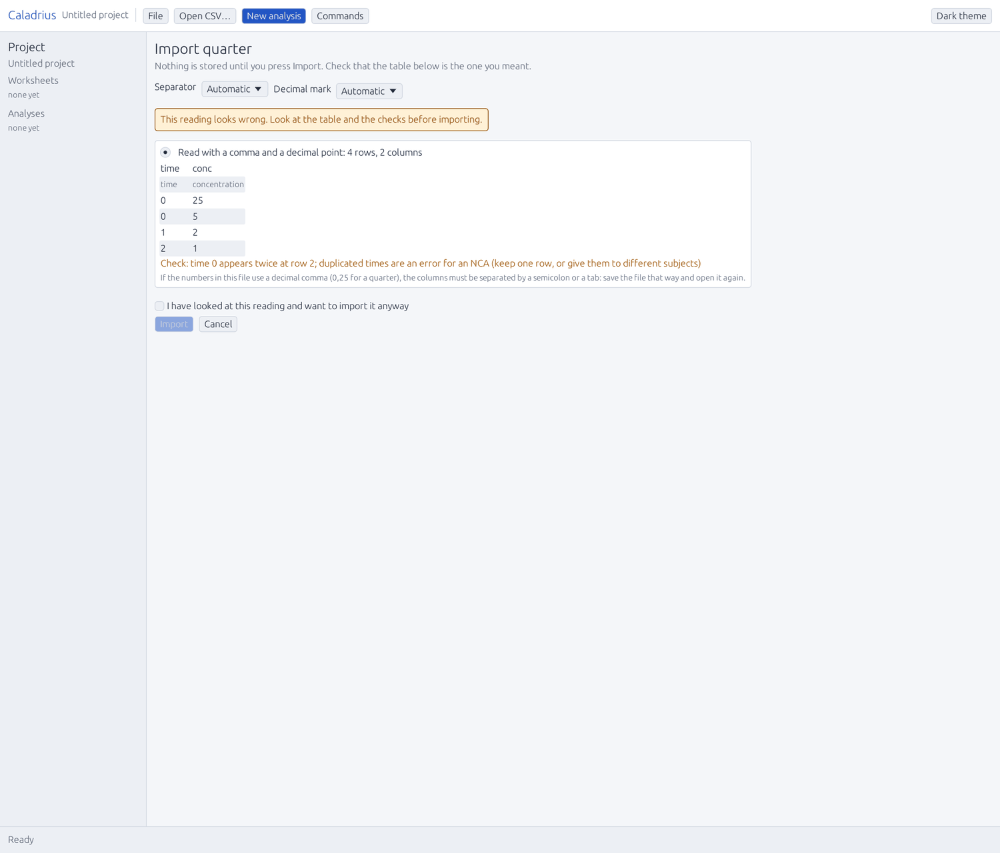</td>
</tr>
<tr>
<td><b>Import, read before anything is stored.</b> A French spreadsheet export (semicolons, decimal
commas) is read as 15 rows and 4 columns; the separator, the decimal mark, the columns' roles and the
units are detected and shown, with the reading of each value stated.</td>
<td><b>The other reading is named, not hidden.</b> When a value such as <code>1,279</code> could be a
decimal mark or a thousands separator, the page says which reading was chosen, which one is the other,
and where to change it. Nothing is written to the project until <code>Import</code>.</td>
</tr>
</table>

## Non-compartmental analysis

<table>
<tr>
<td width="50%"></td>
<td width="50%">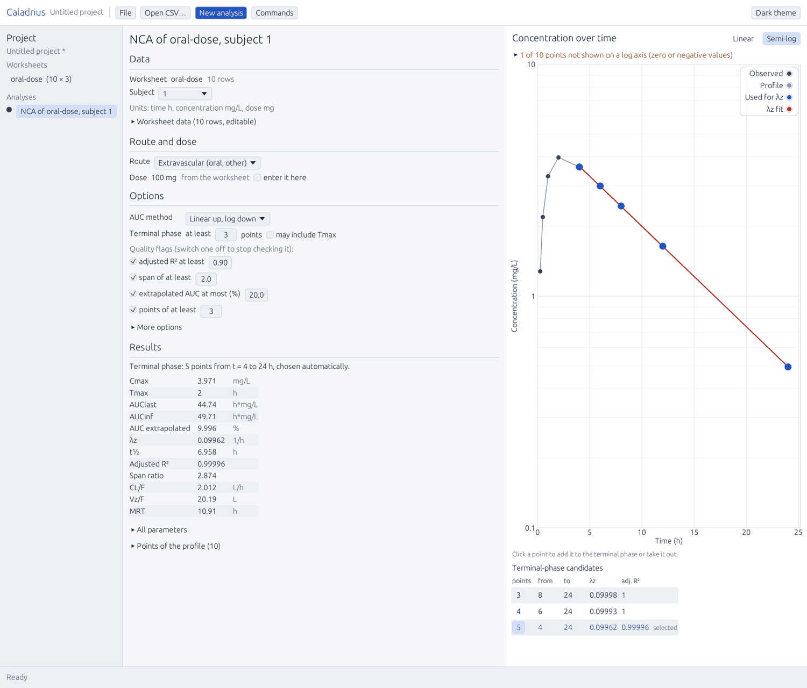</td>
</tr>
<tr>
<td><b>NCA, linear view.</b> Parameters, flags and the terminal-phase candidates are on one page:
Cmax, Tmax, AUClast, AUCinf, % extrapolated, λz, t½, adjusted R², span ratio, CL/F, Vz/F and MRT, each
with its unit. The regression range is chosen automatically (5 points from 4 to 24 h here) and every
candidate range is listed with its adjusted R².</td>
<td><b>Semi-log view, and an honest log axis.</b> A zero concentration cannot be drawn on a log axis;
the point is left out of that view only, the sentence above the plot says how many were, and the value
keeps all its weight in the linear view and in the parameters.</td>
</tr>
<tr>
<td width="50%">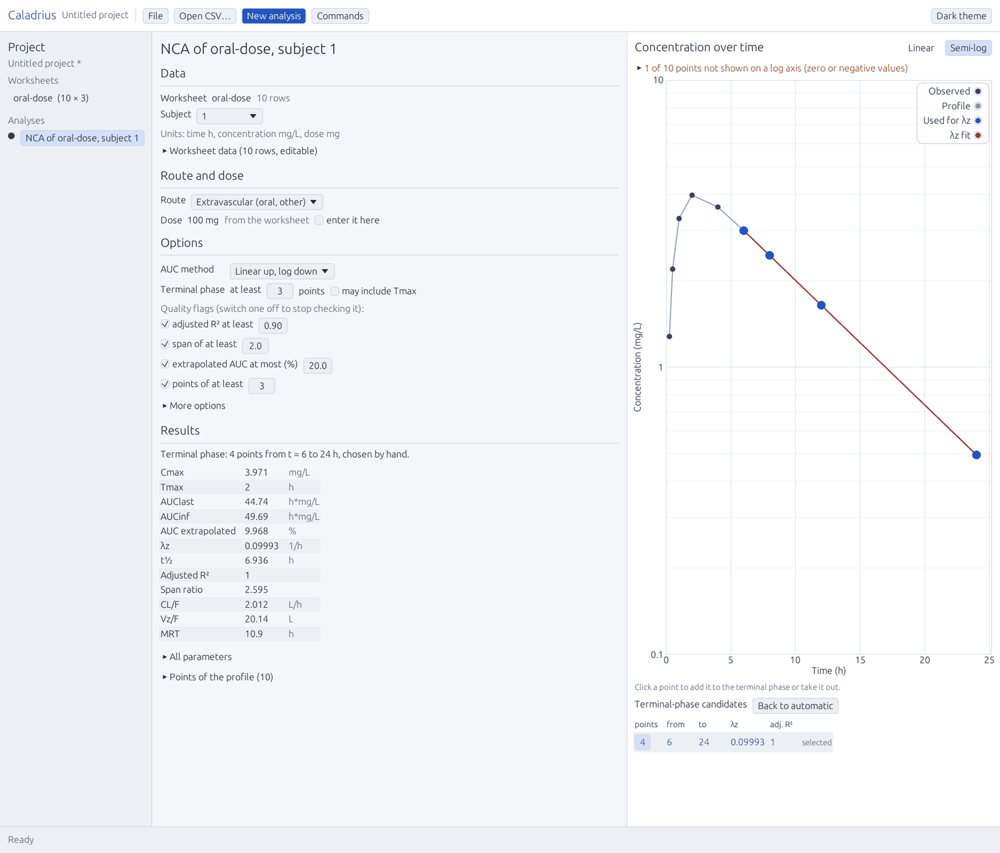</td>
<td width="50%">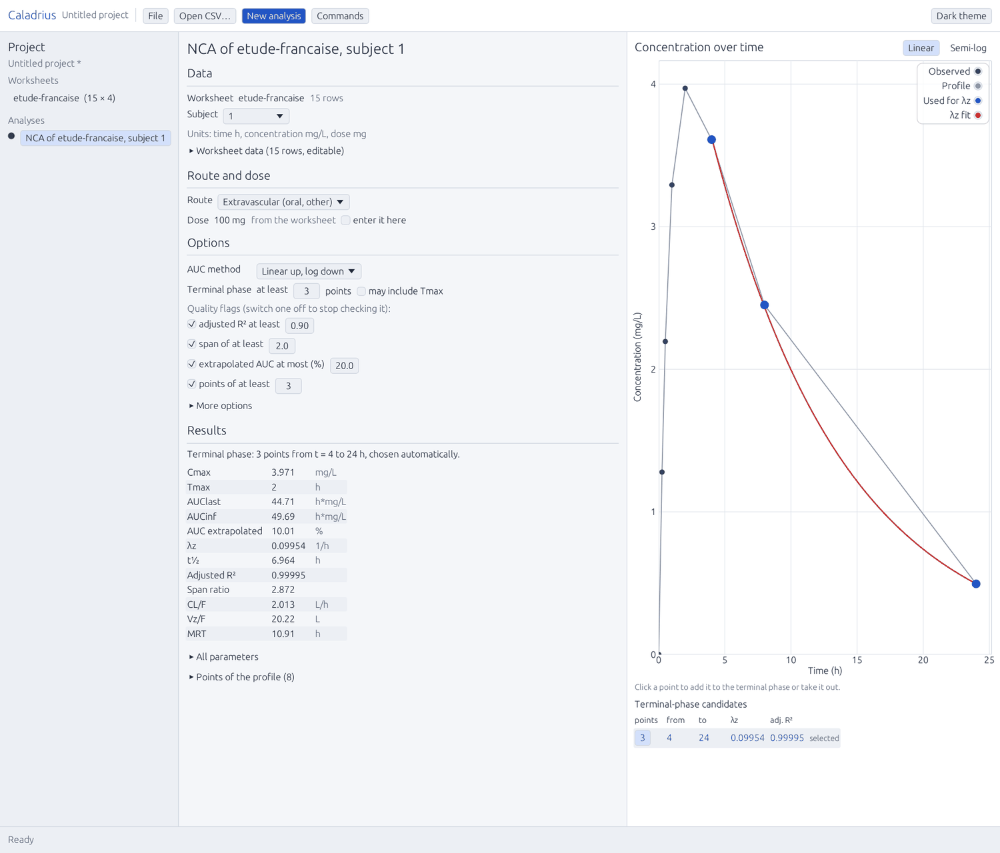</td>
</tr>
<tr>
<td><b>The terminal phase is a decision, not a guess.</b> Any point can be added to or taken out of the
regression by clicking it (or a candidate row); <code>Back to automatic</code> undoes the choice, and
the parameters below follow it.</td>
<td><b>Two subjects, one page each, with the quality flags.</b> Each flag has a sentence saying what
to check, so a badly determined terminal phase (high % extrapolated, low adjusted R², short span) is
visible before the number is quoted anywhere.</td>
</tr>
</table>

## Model fitting

<table>
<tr>
<td width="50%">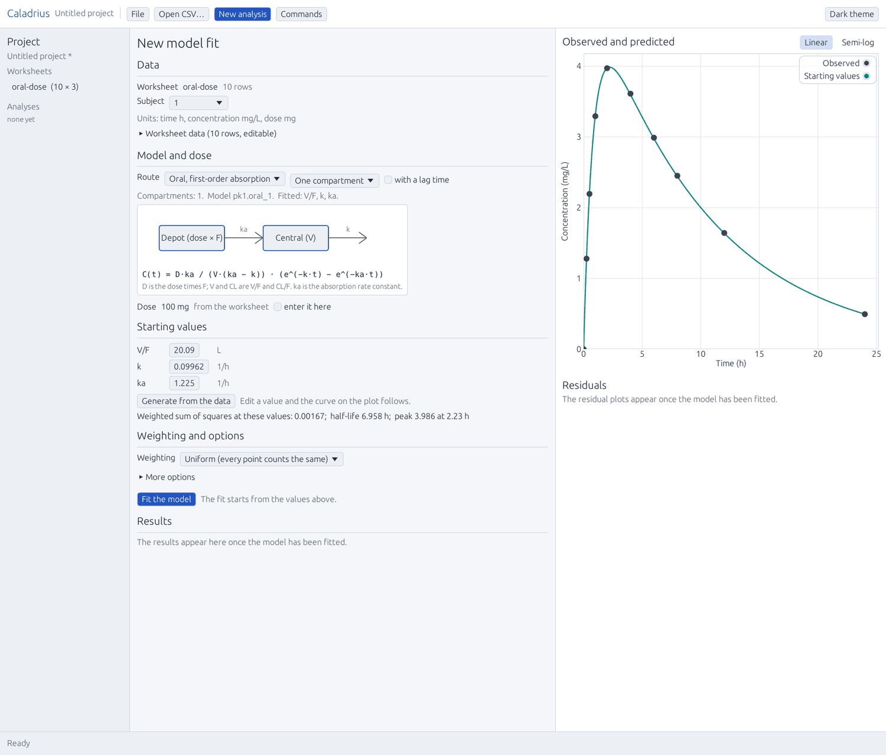</td>
<td width="50%">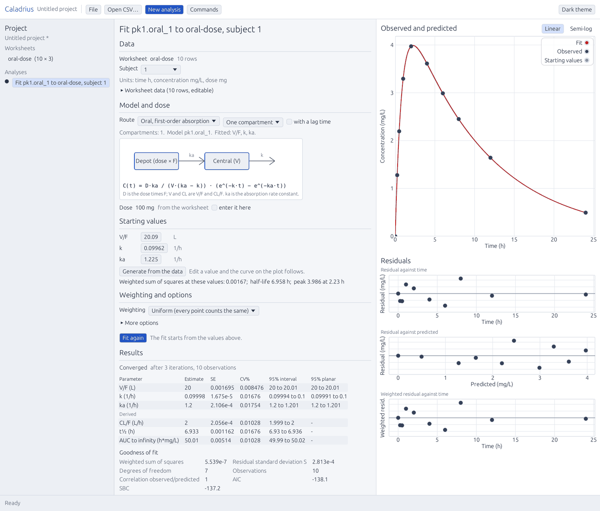</td>
</tr>
<tr>
<td><b>Starting values come from the data.</b> The model is picked by route and shows its compartment
diagram and its equation; the starting values are generated by <code>fit.initial_estimates</code> and
can be edited, with the curve and the weighted sum of squares following every change.</td>
<td><b>The result, curve and residuals together.</b> Estimates with standard error, CV% and both
confidence intervals (univariate and planar), the goodness of fit, and a sentence per flag. The
variance-covariance and correlation matrices, eigenvalues, condition numbers, the trace, the partial
derivatives and the predicted values are one click away.</td>
</tr>
<tr>
<td width="50%">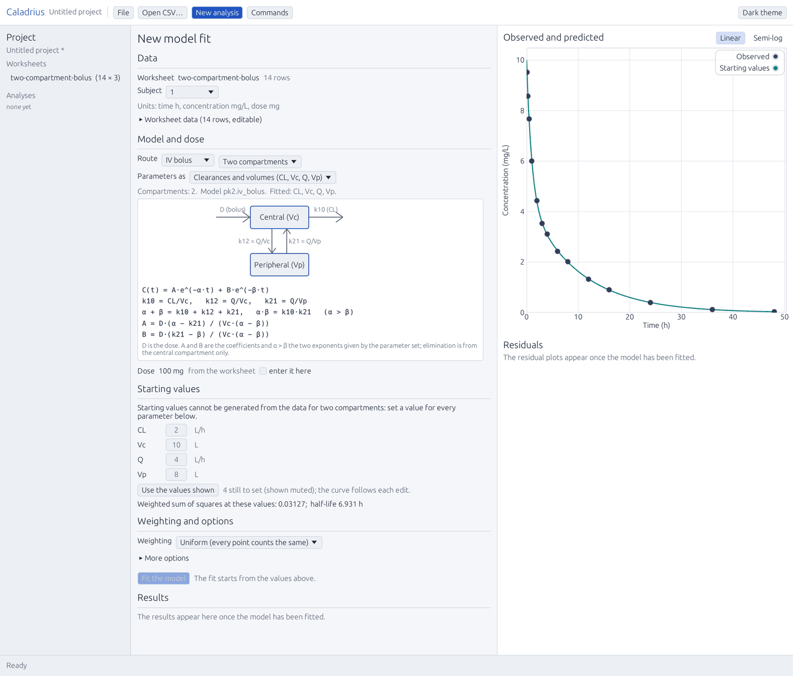</td>
<td width="50%"></td>
</tr>
<tr>
<td><b>Two compartments, three parameter sets.</b> The same page for <code>pk2</code>: the parameter
set is chosen (clearances and volumes here, macro and micro also exist), the diagram and the equation
follow the choice, and the page says that starting values cannot be generated for two compartments, so
every one of them must be typed.</td>
<td><b>Two-compartment results.</b> CL, Q, Vc and Vp with their intervals, the goodness of fit, and the
residuals in three views. The curve on the right is the engine's, computed for the estimates in the
table.</td>
</tr>
<tr>
<td width="50%">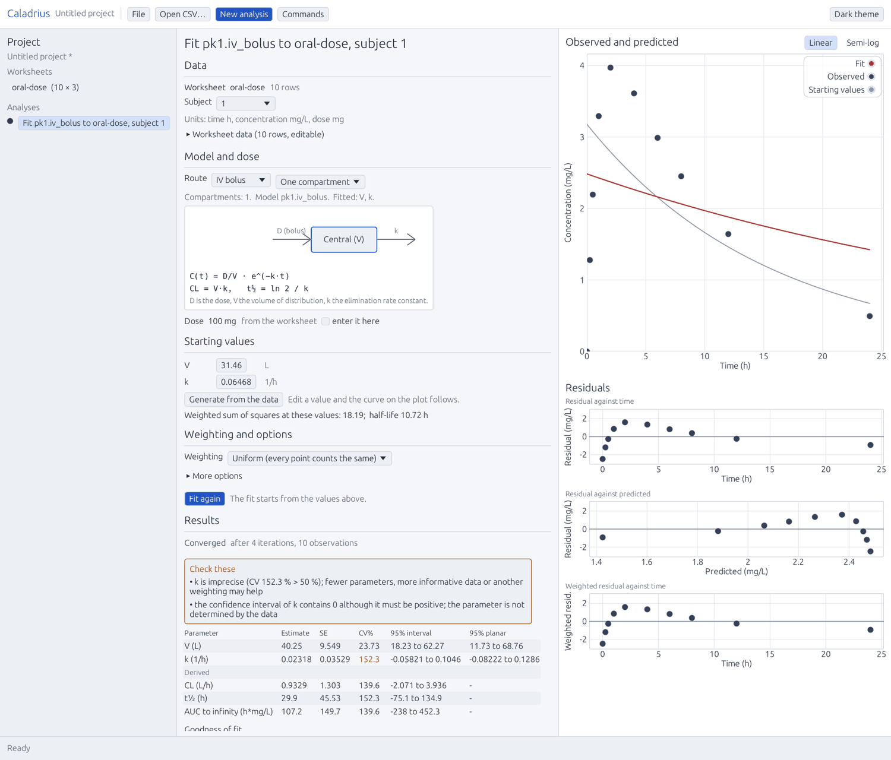</td>
<td width="50%">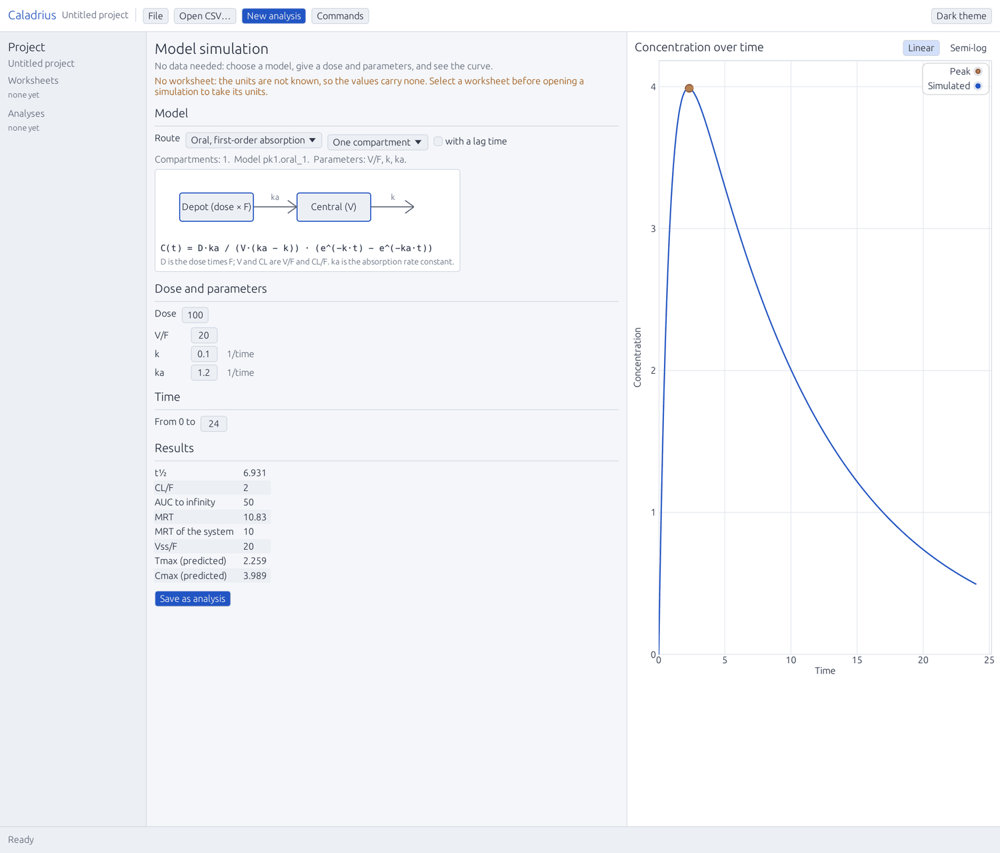</td>
</tr>
<tr>
<td><b>What a bad fit looks like.</b> High CV%, an interval that contains zero, strongly correlated
estimates: each flag says which one fired and what to check, rather than leaving the reader to notice a
large standard error.</td>
<td><b>Simulation without data.</b> A model, a dose, parameters and a time range; the curve and the
secondary parameters (half-life, clearance, AUC to infinity, predicted peak) update as you type. Opened
from a worksheet, the values carry that worksheet's units.</td>
</tr>
</table>

## Navigation

<table>
<tr>
<td width="50%">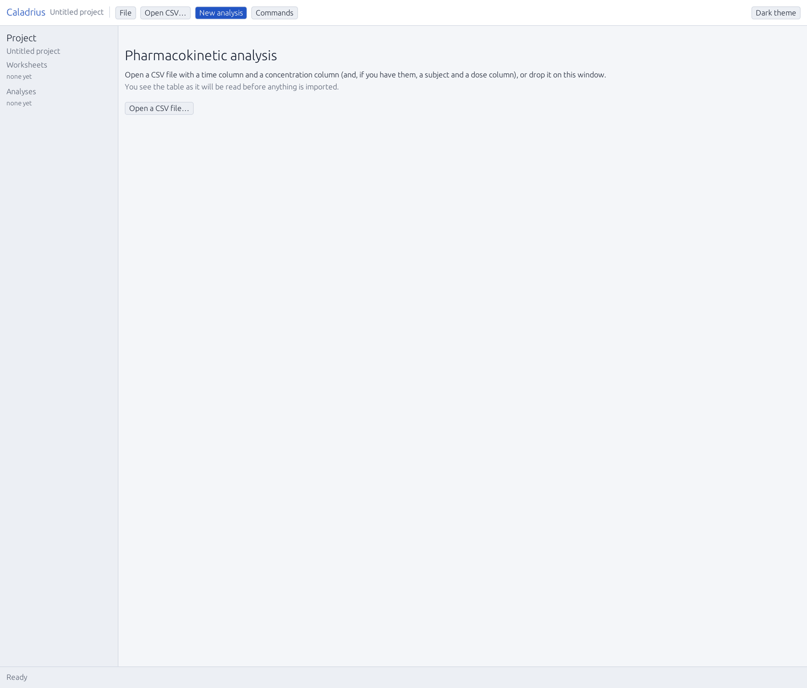</td>
<td width="50%">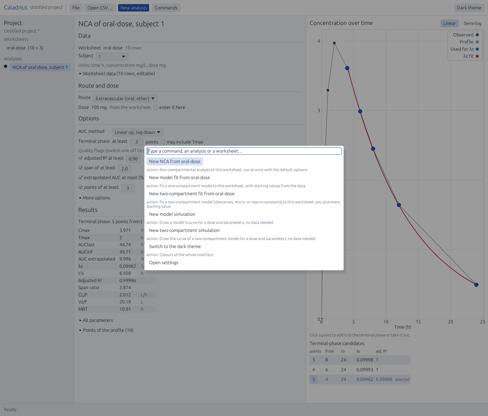</td>
</tr>
<tr>
<td><b>An empty project.</b> The tree holds the worksheets and the analyses; starting a new project,
opening another one or closing with unsaved changes asks first. A saved project is a JSON file that
contains its data, and the README says what to remove before sharing one.</td>
<td><b>The command palette (<code>Ctrl+K</code>).</b> The interface's actions, every worksheet and
analysis by name, and every command of the engine registry with its id and one-line description. The
same commands are what the CLI and the MCP server expose, so the interface cannot drift from them.</td>
</tr>
</table>

## Reading these shots

- The shots are a moving picture of `main`, not of a release: they are regenerated from the example,
  and the example changes with the interface. The `v0.1.0` tag has no two-compartment pages.
- Colours, spacing and font sizes are the tokens of `crates/caladrius-ui/src/theme.json` (light and
  dark); the snapshots in `target/snapshots/` also cover the dark theme and the error, stale-analysis,
  unsaved-changes and settings pages, which are not repeated here.
- The images in this folder are quantised to 256 colours to keep the repository small (about 1.5 MB
  for the fourteen). Regenerate them with the command above and the same map if a page changes.
